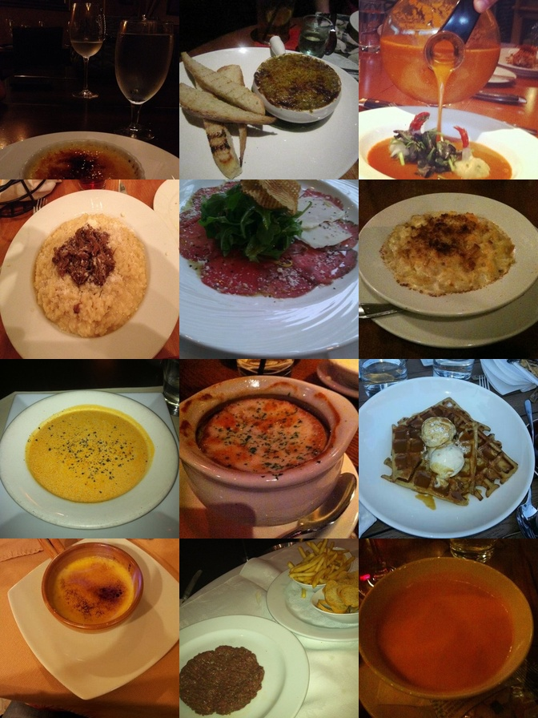
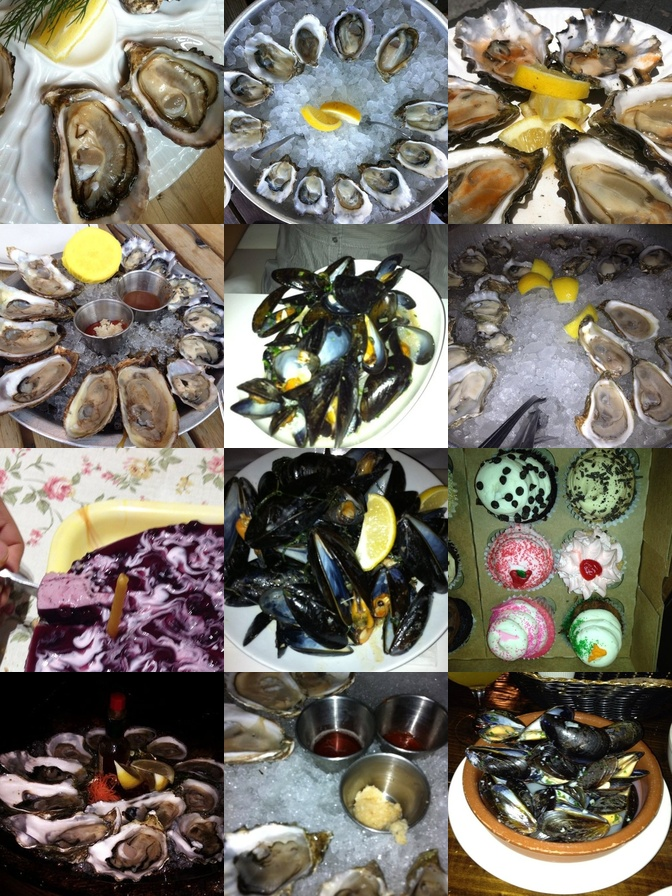
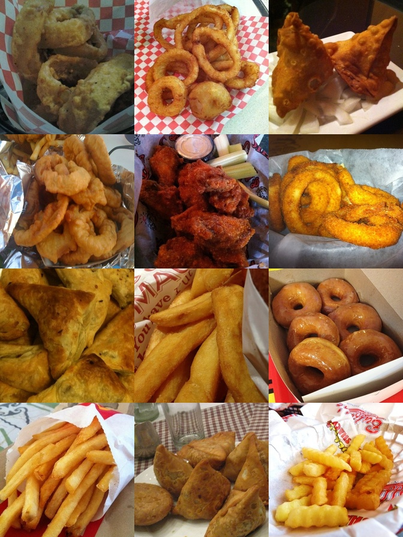

# Отчёт по исследованию разреженных автоэнкодеров для интерпретации внутренних представлений модели CLIP

## Введение

Целью исследования является разработка и обучение SAE для трансформера модели CLIP ViT-B/32 с последующей оценкой качества реконструкции, анализа влияния на точность классификации и интерпретации полученных латентных фичей

## Методология

### Архитектура разреженного автоэнкодера

Разработанная архитектура SAE следует стандартной схеме энкодер-декодер с ключевыми особенностями, обеспечивающими стабильное обучение. Энкодер представляет собой линейный слой без встроенного смещения (bias=False), за которым следует отдельный параметр смещения encoder_bias, применяемый до нелинейной активации ReLU. Декодер реализован как линейный слой без смещения с последующей нормализацией столбцов до единичной длины после каждого шага обучения. Путем предварительного исследования (experiments/test_clip_layers) выявлен наиболее подходящий для задачи интерпретации слой модели - 11ый, что пропорционально соответствует слою, использованному в оригинальном исследовании Towards Multimodal Interpretability: Learning Sparse Features in CLIP" (слой 22/24 для ViT-Large пропорционален слою 11/12 для ViT-B/32).Критически важным решением стало использование механизма топ-К активации: на выходе энкодера сохраняются только топ-500 наибольших активаций (при размере словаря 49 152 фичи), что обеспечивает контролируемую разреженность без необходимости дополнительной L1-регуляризации

### Обучение и гиперпараметры

Обучение проводилось на датасете food101 (75 750 изображений тренировочного сплита) в течение 15 эпох с размером батча 64. Для стабилизации процесса использовался линейный вармап коэффициента разреженности: начальное значение $10^{-6}$ постепенно увеличивалось до целевого 0.01 в течение первых 12 000 шагов (68% от общего числа 17 760 шагов). Такой подход позволил декодеру сойтись до полного включения разреженности, предотвратив коллапс фичей. Оптимизатор Adam применялся только к весам энкодера и параметру смещения, в то время как декодер обновлялся исключительно через нормализацию столбцов. После обучения модель достигла стабильной сходимости с объяснённой дисперсией 80.57%.

### Метрики оценки

Качество обучения оценивалось по четырём ключевым метрикам. Объяснённая дисперсия (Explained Variance Ratio, EVR) рассчитывалась как 1 − (дисперсия ошибки реконструкции / дисперсия оригинальных активаций) и служила основным показателем качества реконструкции. Среднее число активных фичей (L0) контролировало соблюдение целевой разреженности. Дополнительно отслеживалась MSE для реконструкции.

Для оценки влияния на точность классификации проводилась сравнительная оценка нулевого выстрела на двух датасетах разной сложности: CIFAR-10 (10 классов) и CIFAR-100 (100 классов). Выбор обусловлен наличием в оригинальной статье CLIP анализа производительности модели на этих бенчмарках и их доступностью без необходимости авторизации.

## Результаты обучения

Модель продемонстрировала стабильную сходимость с монотонным ростом объяснённой дисперсии от 0.43 на первой эпохе до 0.8057 на пятнадцатой. L0 ~ 500 сохраняет стабильное значение всех этапах обучения. Достигнутое значение EVR 80.57% удовлетворяет установленному порогу. Анализ ошибок показал, что основным ограничением стала недостаточная ёмкость словаря фичей для полного представления разнообразия визуальных паттернов в датасете, а также относительно небольшой объём обучающих данных (75 750 изображений).

## Анализ влияния на точность классификации

Оценка деградации точности при интеграции SAE в пайплайн классификации выявила зависимость от сложности задачи и качества входных данных. На датасете CIFAR-10 (низкое разрешение 32х32, 10 классов) наблюдалась минимальная деградация точности Top-1: 93.66% для оригинального CLIP против 92.13% для модифицированной модели, что составляет снижение на 1.53 процентных пункта (1.63% относительно). На более сложном датасете CIFAR-100 (100 классов) деградация составила 10.04 процентных пункта (с 75.91% до 65.87%), что соответствует относительному снижению 13.23%.

Полученные результаты согласуются с выводами оригинальной статьи CLIP о чувствительности модели к качеству входных данных. Низкое разрешение изображений в обоих датасетах (32х32) приводит к потере деталей при ресайзе до 224×224, что усугубляется ошибкой реконструкции через SAE. Особенно заметен эффект на CIFAR-100, где тонкая семантическая дифференциация между 100 классами требует высокоточных признаков, чувствительных к небольшим искажениям. Тем не менее, минимальная деградация на простых задачах подтверждает применимость подхода для практических сценариев с качественными входными данными.

## Интерпретация латентных представлений

Для анализа семантического содержания фичей был разработан пайплайн автоматической генерации коллажей: для каждой из 300 наиболее активных фичей отбирались 12 изображений с максимальной активацией из подвыборки 5 000 изображений датасета food101, после чего формировались коллажи размером 4×3. Визуальный анализ коллажей позволил выделить три типа латентных представлений (текстовые интерпретации фичей были выполнены вручную на основе визуального анализа коллажей в связи с невозможностью присоединиться к API openrouter.ai).

Семантические признаки демонстрируют чёткие визуальные паттерны, повторяющиеся в различных контекстах. Например, признак, активируемый изображениями с ягодными десертами, проявляется на всех 12 изображениях коллажа через характерное сочетание тёмных ягод на светлом фоне десерта. Аналогичным образом признак "суп-пюре" выделяет однородную текстуру без видимых кусочков ингредиентов, а признак "дамплинги" - округлые формы варёных изделий на тарелке.

Рисунок 1. Признак, активируемый изображениями ягодных десертов

Рисунок 2. Признак "суп-пюре"

Рисунок 3. Признак "дамплинги"

Рисунок 4. Мидии

Рисунок 5. Картофель/лук фри

Рисунок 6. Пример шума без однозначного паттерна

## Анализ результатов

Достигнутое значение EVR 80.57% подтверждает возможность выделения интерпретируемых фичей из внутренних представлений модели CLIP. Результаты демонстрируют, что качество реконструкции напрямую влияет на применимость подхода — при низком EVR (<50%) фичи теряют семантическую осмысленность, тогда как при высоком (>80%) формируются стабильные паттерны.

Деградация точности классификации на 1.53 п.п. для простых задач и 10.04 п.п. для сложных подтверждает гипотезу о чувствительности реконструкции к качеству входных данных. На изображениях высокого разрешения с богатой семантикой (как в исходном датасете обучения food101) ошибка реконструкции менее критична, тогда как на низкокачественных данных даже небольшие искажения приводят к значительной потере информации. Это согласуется с выводами статьи CLIP о преимуществах модели на качественных изображениях и её уязвимости к артефактам низкого разрешения.

## Заключение

В работе успешно реализован и обучен разреженный автоэнкодер для интерпретации активаций модели CLIP с EVR 80.57%. Анализ деградации точности классификации подтвердил применимость подхода для задач с качественными входными данными при минимальной потере точности (1.53 п.п. на простых задачах).

Перспективными направлениями дальнейшего исследования являются:
1. увеличение ёмкости словаря фичей (до 100 000 и более) и объёма обучающих данных (до 500 000 изображений) для достижения объяснённой дисперсии выше 90%, что позволит выделить более тонкие семантические паттерны
2. интеграция механизма управления генерацией через модификацию латентных фичей в пайплайне генеративных моделей (Этап 6 проекта, предполагавший управление генерацией через Kandinsky 2.2)
3. автоматизация процесса интерпретации через разработку метрик количественной оценки семантической согласованности фичей, что снизит зависимость от субъективного визуального анализа.

Полученные результаты подтверждают потенциал разреженных автоэнкодеров как инструмента для интерпретации внутренних представлений мультимодальных моделей и открывают путь к более прозрачному и контролируемому применению современных нейросетей в критически важных задачах.